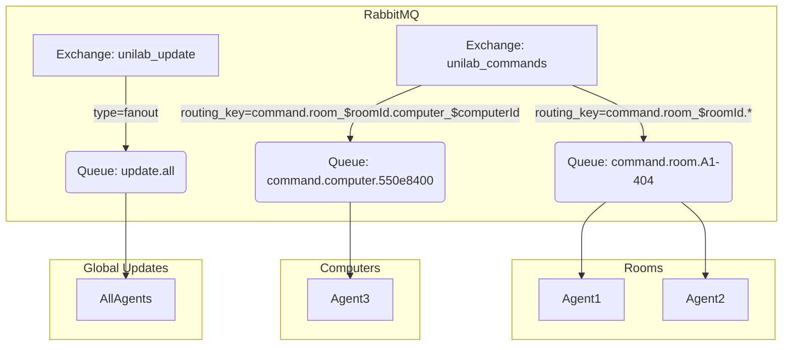
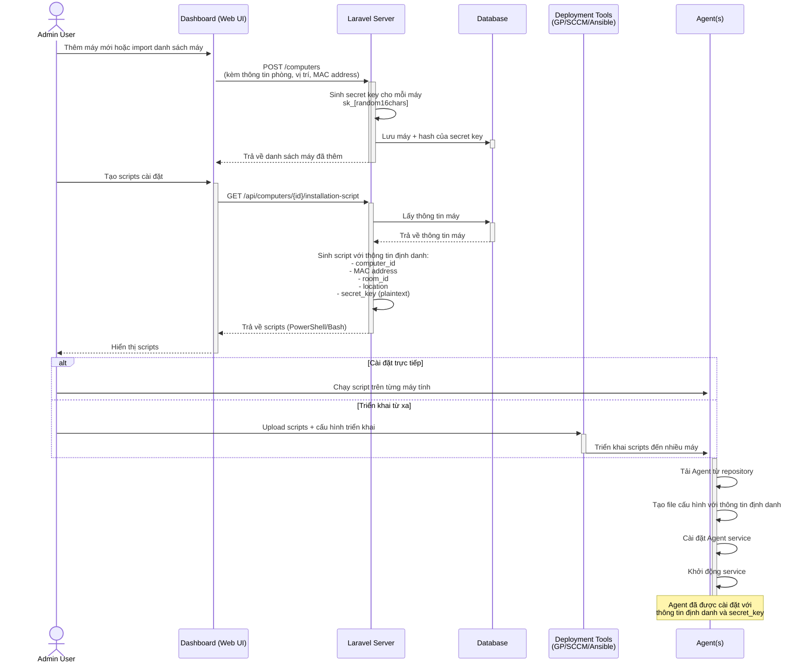
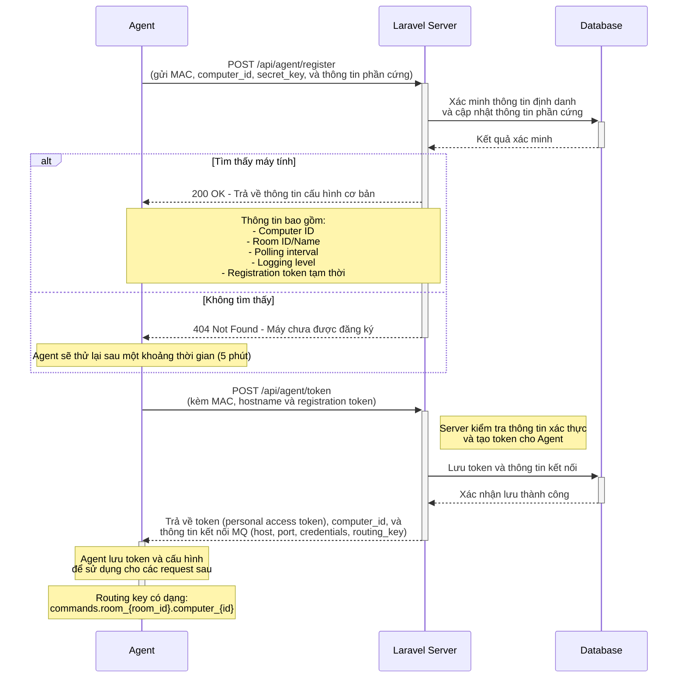
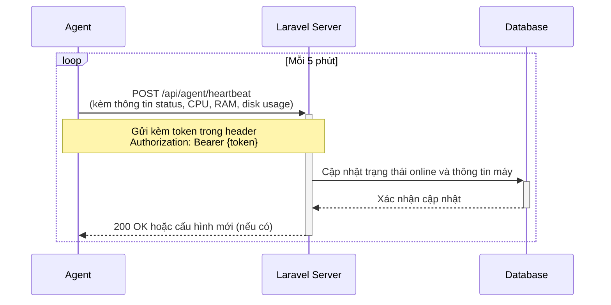
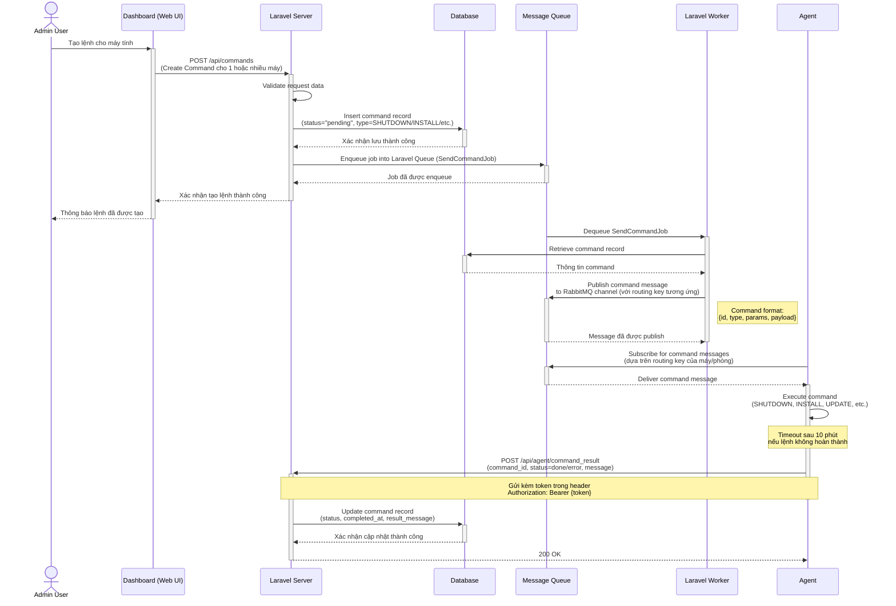
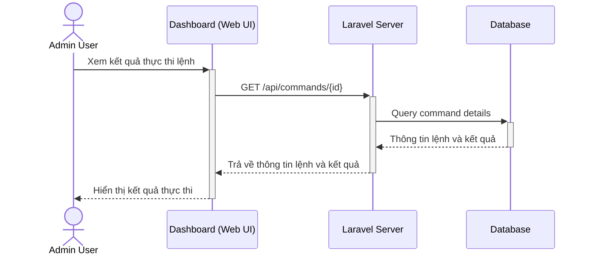
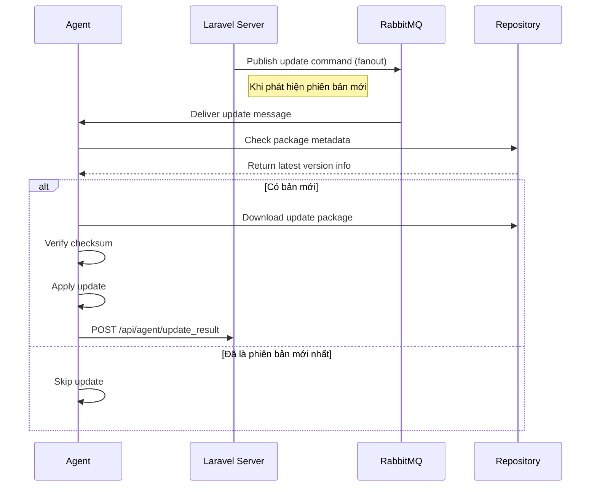

# UniLab - Hệ thống quản lý phòng máy thực hành

## 1. Giới thiệu

UniLab là một hệ thống quản lý phòng máy thực hành cho trường đại học/cao đẳng, cung cấp khả năng giám sát và điều khiển máy tính từ xa thông qua giao diện web.

## 2. Kiến trúc hệ thống

### 2.1 Tổng quan kiến trúc

- **Dashboard (Web UI)**: Giao diện người dùng cho admin, được xây dựng bằng Inertia.js với Vue.js
- **Laravel Server**: Backend API server, sử dụng Laravel framework
- **Agent**: Phần mềm chạy trên máy tính client, được phát triển bằng Python
- **Message Queue**: RabbitMQ để truyền lệnh từ server đến agent
- **Database**: Supabase - nền tảng database PostgreSQL, sử dụng để lưu trữ thông tin phòng, máy, lệnh và kết quả

### 2.2 Thiết kế Message Queue

Hệ thống UniLab sử dụng RabbitMQ làm Message Queue để giao tiếp giữa Laravel Server và Agent, đảm bảo việc truyền lệnh và cập nhật đáng tin cậy, có khả năng mở rộng.

#### 2.2.1 Kiến trúc RabbitMQ



#### 2.2.2 Cấu trúc Exchange và Routing

| Thành phần       | Loại Exchange | Routing Key Pattern         | Mục đích                         |
| ---------------- | ------------- | --------------------------- | -------------------------------- |
| command_exchange | Topic         | command.<scope>.<target>    | Điều khiển máy tính/phòng cụ thể |
| update_exchange  | Fanout        | N/A                         | Cập nhật toàn hệ thống           |
| events_exchange  | Topic         | events.<type>.<computer_id> | Nhận sự kiện từ các agent        |

#### 2.2.3 Routing Key Design

| Pattern                      | Ví dụ                     | Mô tả                     |
| ---------------------------- | ------------------------- | ------------------------- |
| command.room.\<room_id\>     | command.room.A1-404       | Lệnh cho toàn bộ phòng    |
| command.computer.\<comp_id\> | command.computer.550e8400 | Lệnh cho máy tính cụ thể  |
| command.all                  | command.all               | Lệnh cho toàn bộ hệ thống |

#### 2.2.4 Cấu trúc message cập nhật

```json
{
    "type": "SYSTEM_UPDATE",
    "payload": {
        "version": "1.1.0",
        "release_date": "2025-03-15",
        "mandatory": true,
        "checksum": "sha256:9f86d081...",
        "download_url": "https://unilab.example.com/updates/v1.1.0",
        "changelog": ["Cải thiện hiệu suất", "Sửa lỗi bảo mật quan trọng"]
    },
    "conditions": {
        "min_agent_version": "1.0.2",
        "os_requirements": ["windows >= 10", "linux >= ubuntu20.04"]
    }
}
```

### 2.3 Mô hình dữ liệu

#### 2.3.1 Các entity chính

#### 2.3.2 Quan hệ

## 3. Quy trình hoạt động

Hệ thống UniLab hoạt động thông qua các luồng xử lý chính như sau:

### 3.1. Thiết lập ban đầu và cài đặt Agent



### 3.2 Đăng ký và xác thực Agent



### 3.3 Cơ chế heartbeat và giám sát



### 3.4 Xử lý và thực thi lệnh



### 3.5 Xem kết quả thực thi



### 3.6 Cơ chế Cập nhật Tự động

Luồng cập nhật phiên bản:



## 4. Agent Installation Scripts

### 4.1 Tổng quan về Installation Scripts

Thay vì sử dụng installer truyền thống, hệ thống tạo script cài đặt tự động cho từng máy tính. Script này sẽ thực hiện việc tải, cài đặt và cấu hình Agent để kết nối với server.

### 4.2 Quy trình tạo Installation Scripts

1. **Tạo Script Cá nhân hóa**:

    - Admin chọn máy tính cần cài đặt Agent trong Dashboard
    - Hệ thống sinh script cài đặt (PowerShell/Bash) riêng cho máy tính đó
    - Script được tạo với các thông số nhận dạng máy tính đã được định nghĩa trước

2. **Nội dung Script**:
    - Tải xuống phần mềm Agent từ repository
    - Tạo file cấu hình với thông tin đặc thù cho máy tính
    - Cài đặt Agent và đăng ký nó như service hệ thống
    - Khởi động service và xác minh kết nối với server

### 4.3 Ví dụ về Installation Script

**Python Script (Windows):**

```python
#!/usr/bin/env python3
# UniLab Agent Installation Script
# Auto-generated for Computer: LAB-PC-42 in Room: A1-404
# Generated on: 2025-03-08

import os
import sys
import json
import time
import shutil
import zipfile
import tempfile
import subprocess
import urllib.request
from pathlib import Path

# Thông tin cài đặt
SERVER_URL = "https://unilab.example.com"
SECRET_KEY = "sk_wAb5DcE2fG3hI4jK5"
AGENT_DOWNLOAD_URL = "https://unilab.example.com/downloads/agent/latest/windows"
CONFIG_DIR = os.path.join(os.environ.get('PROGRAMDATA', 'C:\\ProgramData'), 'UniLab', 'Agent')
INSTALL_DIR = os.path.join(os.environ.get('PROGRAMFILES', 'C:\\Program Files'), 'UniLab', 'Agent')

def print_status(message, status="info"):
    """In thông báo với màu sắc"""
    colors = {
        "info": "\033[94m",    # Blue
        "success": "\033[92m",  # Green
        "warning": "\033[93m",  # Yellow
        "error": "\033[91m",    # Red
        "end": "\033[0m"        # Reset
    }
    
    print(f"{colors.get(status, '')}{message}{colors['end']}")

def create_directories():
    """Tạo thư mục cài đặt và cấu hình"""
    print_status("Tạo thư mục cài đặt...", "info")
    
    os.makedirs(CONFIG_DIR, exist_ok=True)
    os.makedirs(INSTALL_DIR, exist_ok=True)
    
    return True

def download_agent():
    """Tải agent từ server"""
    print_status("Đang tải phần mềm Agent...", "info")
    
    try:
        temp_file = os.path.join(tempfile.gettempdir(), "unilab_agent.zip")
        urllib.request.urlretrieve(AGENT_DOWNLOAD_URL, temp_file)
        
        # Giải nén tập tin
        with zipfile.ZipFile(temp_file, 'r') as zip_ref:
            zip_ref.extractall(INSTALL_DIR)
        
        os.remove(temp_file)
        return True
    except Exception as e:
        print_status(f"Lỗi khi tải agent: {str(e)}", "error")
        return False

def create_config():
    """Tạo file cấu hình"""
    print_status("Tạo file cấu hình...", "info")
    
    config = {
        "server": {
            "url": SERVER_URL,
            "api_base": "/api/agent"
        },
        "agent": {
            "heartbeat_interval": 300,
            "logging_level": "info"
        },
        "security": {
            "secret_key": SECRET_KEY
        },
        "identification": {
            "computer_id": "550e8400-e29b-41d4-a716-446655440000",
            "mac_address": "00:1B:44:11:3A:B7", 
            "room_id": "123",
            "location": "R3-S5",
            "expected_hostname": "LAB-PC-42"
        }
    }
    
    config_path = os.path.join(CONFIG_DIR, "config.json")
    with open(config_path, 'w', encoding='utf-8') as f:
        json.dump(config, f, indent=4)
    
    return True

def install_service():
    """Cài đặt agent như một Windows service"""
    print_status("Cài đặt Windows Service...", "info")
    
    try:
        service_path = os.path.join(INSTALL_DIR, "install-service.exe")
        subprocess.run([service_path], check=True)
        return True
    except Exception as e:
        print_status(f"Lỗi khi cài đặt service: {str(e)}", "error")
        return False

def start_service():
    """Khởi động service"""
    print_status("Khởi động UniLab Agent service...", "info")
    
    try:
        if sys.platform == 'win32':
            subprocess.run(["sc", "start", "UniLabAgent"], check=True)
        else:
            subprocess.run(["systemctl", "start", "unilab-agent"], check=True)
        return True
    except Exception as e:
        print_status(f"Lỗi khi khởi động service: {str(e)}", "error")
        return False

def verify_installation():
    """Kiểm tra trạng thái cài đặt"""
    print_status("Xác minh cài đặt...", "info")
    
    try:
        if sys.platform == 'win32':
            result = subprocess.run(
                ["sc", "query", "UniLabAgent"], 
                capture_output=True, 
                text=True, 
                check=True
            )
            running = "RUNNING" in result.stdout
        else:
            result = subprocess.run(
                ["systemctl", "is-active", "unilab-agent"],
                capture_output=True,
                text=True
            )
            running = "active" in result.stdout
            
        if running:
            print_status("Cài đặt hoàn tất thành công!", "success")
        else:
            print_status("Cài đặt hoàn tất, nhưng service không chạy. Vui lòng kiểm tra logs.", "warning")
        
        return running
    except Exception as e:
        print_status(f"Lỗi khi kiểm tra service: {str(e)}", "error")
        return False

def main():
    """Quy trình cài đặt chính"""
    print_status("=== BẮT ĐẦU CÀI ĐẶT UNILAB AGENT ===", "success")
    
    # Kiểm tra quyền admin
    if sys.platform == 'win32' and os.name == 'nt':
        try:
            is_admin = os.getuid() == 0
        except AttributeError:
            import ctypes
            is_admin = ctypes.windll.shell32.IsUserAnAdmin() != 0
            
        if not is_admin:
            print_status("Script cần được chạy với quyền Administrator!", "error")
            return False
    
    # Các bước cài đặt
    steps = [
        ("Tạo thư mục", create_directories),
        ("Tải phần mềm Agent", download_agent),
        ("Tạo file cấu hình", create_config),
        ("Cài đặt service", install_service),
        ("Khởi động service", start_service),
        ("Xác minh cài đặt", verify_installation)
    ]
    
    for step_name, step_func in steps:
        print_status(f"\nBước: {step_name}", "info")
        success = step_func()
        if not success:
            print_status(f"Cài đặt thất bại ở bước: {step_name}", "error")
            return False
            
    print_status("\n=== CÀI ĐẶT UNILAB AGENT HOÀN TẤT ===", "success")
    print_status("Agent đã được cài đặt và đang chạy.", "success")
    print_status("Máy tính sẽ tự động đăng ký với UniLab Server trong vài phút.", "info")
    return True

if __name__ == "__main__":
    success = main()
    sys.exit(0 if success else 1)
```

### 4.4 Ưu điểm khi sử dụng Python cho Installation Script
1. Tính nhất quán - Sử dụng Python cho cả Agent và Installation Script
2. Khả năng đa nền tảng - Mã nguồn Python có thể chạy trên nhiều hệ điều hành với ít thay đổi
3. Dễ tùy biến - Có thể dễ dàng thêm tính năng mới
4. Xử lý lỗi tốt hơn - Python có hệ thống xử lý ngoại lệ mạnh mẽ
5. Hỗ trợ thư viện phong phú - Sử dụng các thư viện Python có sẵn cho nhiều tác vụ
6. Trình bày UI tốt hơn - Dễ dàng thêm màu sắc, thanh tiến trình, v.v.

#### Quy trình sử dụng

1. **Tải script**: Admin tải script từ Dashboard
2. **Chạy script**: Admin chạy script trên máy tính đích với quyền admin
3. **Xác minh**: Script tự động cài đặt, cấu hình và khởi động Agent
4. **Đăng ký**: Agent khi khởi động sẽ tự động đăng ký với server

### 4.5 Triển khai với Ansible

Hệ thống hỗ trợ cài đặt Agent trên nhiều máy tính cùng lúc mà không cần admin phải đi từng máy:

```yaml
# playbook.yml
- hosts: lab_computers
  become: yes
  tasks:
    - name: Tạo thư mục tạm thời
      file:
        path: /tmp/unilab-agent
        state: directory
        mode: '0755'
      
    - name: Sao chép installation script
      copy:
        src: "files/install-agent-{{ inventory_hostname }}.py"
        dest: /tmp/unilab-agent/install.py
        mode: '0755'
      
    - name: Chạy installation script
      command: python3 /tmp/unilab-agent/install.py
      register: install_result
      
    - name: Xem log cài đặt
      debug:
        var: install_result.stdout_lines
```

### 4.6 Cấu trúc thông tin định danh

Mỗi script cài đặt chứa thông tin định danh riêng cho từng máy tính:

```json
// Cấu trúc identification trong config.json
{
    "identification": {
        "computer_id": "550e8400-e29b-41d4-a716-446655440000",
        "mac_address": "00:1B:44:11:3A:B7",
        "room_id": "123",
        "location": "R3-S5",
        "expected_hostname": "LAB-PC-42"
    },
    "security": {
        "secret_key": "sk_wAb5DcE2fG3hI4jK5"
    }
}
```

### 4.7 Về Secret Key

Secret key đóng vai trò quan trọng trong quy trình xác thực Agent:

1. **Mục đích**:

    - Cơ chế xác thực một lần trong quá trình đăng ký ban đầu
    - Ngăn chặn việc máy tính không xác định tự đăng ký vào hệ thống
    - Đóng vai trò "mật khẩu tạm thời" trước khi token hệ thống được cấp

2. **Lưu trữ**:

    - **Database**: Lưu dạng hash cùng với bản ghi máy tính
    - **Script**: Nhúng dạng plaintext để sử dụng khi cài đặt
    - **Agent**: Lưu tạm thời trong quá trình đăng ký, xóa sau khi nhận token

3. **Sinh và xác thực**:

    ```php
    // Sinh secret key (Laravel)
    $secretKey = 'sk_' . Str::random(16);
    $computer->secret_key = Hash::make($secretKey);

    // Xác thực secret key (Laravel)
    if (!Hash::check($request->secret_key, $computer->secret_key)) {
        return response()->json(['error' => 'Invalid secret key'], 401);
    }
    ```

4. **Vòng đời**:
    - Được tạo khi admin thêm máy tính vào hệ thống
    - Sử dụng trong quá trình đăng ký Agent
    - Bị vô hiệu hóa sau lần sử dụng đầu tiên thành công
    - Có thể tạo lại nếu cần thiết (ví dụ: cài đặt lại Agent)

## 5. API Reference

### 5.1 API Đăng ký và Xác thực Agent

#### 5.1.1 **POST /api/agent/register**

    - **Mô tả**: Agent đăng ký với hệ thống khi khởi động đầu tiên

- **Request**:

    ```json
    {
        "computer_id": "550e8400-e29b-41d4-a716-446655440000",
        "mac_address": "00:1B:44:11:3A:B7",
        "secret_key": "sk_wAb5DcE2fG3hI4jK5",
        "hostname": "LAB-PC-42",
        "os": {
            "name": "Windows",
            "version": "10 Pro",
            "build": "22H2"
        },
        "specs": {
            "cpu": "Intel Core i5-10400",
            "cpu_cores": 6,
            "cpu_threads": 12,
            "ram_total": 17179869184,
            "disk_total": 500107862016,
            "disk_free": 213546065920,
            "gpu": "Intel UHD Graphics 630"
        },
        "agent_version": "1.0.5",
        "installation_timestamp": 1709125482
    }
    ```

- **Quy trình xác minh**:

    ```php
    // Quy trình xác minh (Laravel)
    $computer = Computer::find($request->computer_id);

    if (!$computer ||
        $computer->mac_address !== $request->mac_address ||
        !Hash::check($request->secret_key, $computer->secret_key)) {
        return response()->json(['error' => 'Invalid identification'], 401);
    }

    // Đánh dấu secret_key đã được sử dụng
    $computer->secret_key_used = true;
    $computer->save();
    ```

- **Response Success** (200 OK):

    ```json
    {
        "success": true,
        "room": {
            "id": "123",
            "name": "Lab A1-404"
        },
        "config": {
            "polling_interval": 300,
            "logging_level": "info",
            "client_update": {
                "available": false,
                "version": null
            }
        },
        "registration_token": "temp_token_for_next_step",
        "token_expires_at": "2025-03-09T12:30:00Z"
    }
    ```

- **Response Failure** (404 Not Found):

    ```json
    {
        "success": false,
        "message": "Computer not found in system",
        "retry_after": 300
    }
    ```

#### 5.1.2 **POST /api/agent/token**

- **Mô tả**: Lấy token xác thực cho Agent sau khi đăng ký thành công
- **Request**:

    ```json
    {
        "registration_token": "temp_token_for_next_step",
        "computer_id": "550e8400-e29b-41d4-a716-446655440000",
        "mac_address": "00:1B:44:11:3A:B7",
        "hostname": "LAB-PC-42"
    }
    ```

- **Response** (200 OK):

    ```json
    {
        "token": "eyJ0eXAiOiJKV1QiLCJhbGciOiJIUzI1NiJ9...",
        "token_expires_at": "2025-04-09T00:00:00Z",
        "mq_config": {
            "host": "rabbitmq.example.com",
            "port": 5672,
            "username": "agent_user",
            "password": "********",
            "virtual_host": "/",
            "exchange": "commands",
            "routing_key": "commands.room_123.computer_550e8400"
        },
        "api_endpoints": {
            "heartbeat": "/api/agent/heartbeat",
            "command_result": "/api/agent/command_result",
            "token_refresh": "/api/agent/refresh_token"
        }
    }
    ```

#### 5.1.3 **Ý nghĩa của các tham số cấu hình**

##### **Config từ server**

Các tham số cấu hình này đóng vai trò quan trọng trong việc kiểm soát hành vi của Agent:

1. **`polling_interval: 300`**

    - **Đơn vị**: Giây
    - **Tác dụng**: Xác định tần suất Agent gửi heartbeat đến server
    - **Ý nghĩa thực tế**: Mỗi 5 phút (300 giây), Agent sẽ gửi thông tin trạng thái lên server
    - **Lợi ích**:
        - Server biết máy tính có đang hoạt động hay không
        - Giảm tải cho server và mạng (so với heartbeat quá thường xuyên)
        - Có thể điều chỉnh tùy theo nhu cầu giám sát (giảm xuống khi cần giám sát chặt chẽ)

2. **`logging_level: "info"`**

    - **Tác dụng**: Điều khiển mức độ chi tiết của thông tin log từ Agent
    - **Các mức có thể có**:
        - `debug`: Mọi thông tin, chi tiết nhất (hữu ích khi gỡ lỗi)
        - `info`: Thông tin hoạt động thông thường
        - `warning`: Chỉ ghi cảnh báo và lỗi
        - `error`: Chỉ ghi lỗi nghiêm trọng
    - **Lợi ích**: Giúp quản lý kích thước file log và tìm kiếm thông tin quan trọng

3. **`client_update`**
    - **Tác dụng**: Cơ chế tự động cập nhật Agent
    - **Các tham số con**:
        - `available: false`: Hiện không có bản cập nhật mới
        - `version: null`: Không có phiên bản mới nào được xác định
    - **Khi có cập nhật**:

        ```json
        "client_update": {
          "available": true,
          "version": "1.0.6",
          "download_url": "https://unilab.example.com/downloads/agent/1.0.6/windows",
          "force_update": false,
          "changelog": "Cải thiện bảo mật, sửa lỗi kết nối"
        }
        ```

    - **Lợi ích**:
        - Quản lý phiên bản phần mềm tập trung
        - Tự động cập nhật không cần thủ công
        - Đảm bảo tất cả Agent đều chạy phiên bản mới nhất

Server có thể thay đổi các tham số này qua các lần heartbeat để điều chỉnh hành vi Agent từ xa.

### 5.2 API Heartbeat và Trạng Thái

#### 5.2.1 **POST /api/agent/heartbeat**

- **Mô tả**: Agent gửi trạng thái định kỳ
- **Headers**: `Authorization: Bearer {token}`
- **Request**:

    ```json
    {
        "computer_id": "550e8400-e29b-41d4-a716-446655440000",
        "status": "online",
        "resources": {
            "cpu_usage": 15.5,
            "ram_usage": 4567452672,
            "ram_total": 17179869184,
            "disk_usage": 250500000000,
            "disk_total": 500000000000
        },
        "agent_version": "1.0.5",
        "uptime": 18542
    }
    ```

- **Response** (200 OK):

    ```json
    {
        "success": true,
        "config_changed": false
    }
    ```

### 5.3 API Kết quả Lệnh

#### 5.3.1 **POST /api/agent/command_result**

- **Mô tả**: Agent gửi kết quả thực thi lệnh
- **Headers**: `Authorization: Bearer {token}`
- **Request**:

    ```json
    {
        "command_id": "a1b2c3d4-e5f6-4a5b-8c7d-9e0f1a2b3c4d",
        "status": "done", // hoặc "error"
        "message": "Command executed successfully"
    }
    ```

- **Response** (200 OK):

    ```json
    {
        "success": true,
        "message": "Command status updated successfully"
    }
    ```

## 6. Các loại lệnh hỗ trợ

1. **SHUTDOWN**: Tắt máy tính

    - Params: `{ "delay": 60, "force": false }`

2. **RESTART**: Khởi động lại máy tính

    - Params: `{ "delay": 30, "force": false }`

3. **INSTALL**: Cài đặt phần mềm

    - Params: `{ "package": "vscode", "version": "latest" }`

4. **UPDATE**: Cập nhật hệ thống/phần mềm

    - Params: `{ "target": "system" }` hoặc `{ "target": "application", "name": "chrome" }`

5. **EXECUTE**: Thực thi lệnh/script
    - Params: `{ "command": "ipconfig /flushdns", "shell": "cmd" }`

## 7. Xử lý lỗi và phục hồi

1. **Mất kết nối**:

    - Agent sẽ lưu cache lệnh chưa hoàn thành
    - Tự động kết nối lại sau 30 giây và tiếp tục thực thi

2. **Lệnh thất bại**:

    - Thử lại tối đa 3 lần với các lệnh quan trọng
    - Ghi log chi tiết lỗi và gửi về server

3. **Token hết hạn**:
    - Tự động làm mới token khi gặp lỗi 401 Unauthorized
    - Quay lại quy trình đăng ký nếu không thể làm mới token

## 8. Roadmap phát triển UniLab

## Phân loại ưu tiên theo MoSCoW

- **M (Must have)**: Chức năng thiết yếu, không thể thiếu
- **S (Should have)**: Quan trọng nhưng không khẩn cấp
- **C (Could have)**: Mong muốn nhưng có thể bỏ qua
- **W (Won't have)**: Sẽ được xem xét trong tương lai

## 1. Core Infrastructure - Hạ tầng cốt lõi (M)

- [x] Thiết lập Database Schema (migrations, models, relationships)
- [x] Cấu hình Laravel Server cơ bản
- [x] Thiết lập RabbitMQ và Message Queue architecture
- [x] Cài đặt Laravel Sanctum cho API authentication
- [ ] Security framework cho API endpoints

## 2. Backend Core - Chức năng backend chính (M)

- [x] API CRUD cho phòng và máy tính
- [ ] Hệ thống sinh secret key bảo mật
- [x] Endpoint POST `/api/commands` và job xử lý
- [ ] API tạo Installation Scripts
- [ ] Endpoint đăng ký Agent (`/api/agent/register`)
- [ ] Endpoint xác thực Agent (`/api/agent/token`)
- [ ] Endpoint heartbeat (`/api/agent/heartbeat`)
- [x] API nhận kết quả lệnh từ Agent

## 3. Agent Development - Phát triển Agent (M)

- [x] Module lắng nghe lệnh từ RabbitMQ
- [ ] Module thực thi các lệnh cơ bản (SHUTDOWN, RESTART)
- [ ] Module gửi heartbeat và thông tin tài nguyên
- [ ] Module tự động cập nhật Agent
- [ ] Cơ chế phục hồi khi mất kết nối
- [ ] Xử lý token authentication

## 4. Frontend Dashboard Core - Dashboard cơ bản (M)

- [x] Thiết kế hệ thống UI components sử dụng Vue.js
- [x] Xây dựng layout chính và navigation
- [x] Tích hợp authentication UI
- [x] Giao diện quản lý phòng và máy tính
- [x] Giao diện tạo và gửi lệnh đến agent
- [ ] UI hiển thị trạng thái máy tính
- [ ] Responsive design cho tất cả màn hình

## 5. Command & Control - Hệ thống điều khiển (M)

- [x] Thiết lập RabbitMQ exchanges và routing patterns
- [ ] Command dispatcher từ server đến agent
- [ ] Triển khai các loại lệnh cơ bản (SHUTDOWN, RESTART)
- [ ] Tracking và hiển thị trạng thái lệnh
- [ ] Hệ thống queuing commands khi agent offline
- [ ] Xử lý retry cho các lệnh thất bại

## 6. Agent Auto-Update - Cập nhật tự động (M)

- [ ] Versioning system cho Agent
- [ ] API endpoint cung cấp metadata về phiên bản mới
- [ ] Module download và verify package cập nhật
- [ ] Cơ chế cài đặt cập nhật và rollback nếu lỗi
- [ ] Hệ thống phân phối cập nhật theo nhóm/phòng

## 7. User Management - Quản lý người dùng (S)

- [ ] Hệ thống phân quyền (RBAC)
- [ ] Quản lý người dùng và nhóm quyền
- [ ] Nhật ký hoạt động người dùng
- [ ] Self-service password reset
- [ ] Profile và cài đặt người dùng

## 8. Advanced Monitoring - Giám sát nâng cao (S)

- [ ] Dashboard giám sát real-time
- [ ] Biểu đồ theo dõi hiệu suất
- [ ] Hệ thống cảnh báo khi máy offline/quá tải
- [ ] Monitoring API thời gian thực
- [ ] Trang trạng thái hệ thống (health monitoring)

## 9. Advanced Commands - Lệnh nâng cao (S)

- [ ] Lệnh INSTALL cho cài đặt phần mềm
- [ ] Lệnh UPDATE cho cập nhật hệ thống/phần mềm
- [ ] Lệnh EXECUTE cho thực thi script tùy chỉnh
- [ ] Job scheduling cho lệnh định kỳ
- [ ] Lệnh template và kịch bản tùy chỉnh

## 10. Deployment Tools - Công cụ triển khai (S)

- [ ] Tạo installation scripts hàng loạt
- [ ] Công cụ triển khai từ xa (Group Policy/Ansible)
- [ ] Giao diện tạo và tải scripts từ Dashboard
- [ ] Package management cho Agent
- [ ] Deployment analytics và báo cáo

## 11. Data Management - Quản lý dữ liệu (C)

- [ ] Tính năng import/export danh sách máy
- [ ] Kéo-thả để sắp xếp vị trí máy tính trong phòng
- [ ] Quản lý metadata và custom fields
- [ ] Tagging và phân loại máy tính
- [ ] Data cleansing và validation tools

## 12. Reporting - Báo cáo và phân tích (C)

- [ ] Trang tạo và xem báo cáo sử dụng phòng máy
- [ ] Biểu đồ và thống kê sử dụng tài nguyên
- [ ] Báo cáo hiệu suất và tình trạng phần cứng
- [ ] Export báo cáo (PDF, Excel)
- [ ] Custom dashboard widgets

## 13. Testing & Quality - Kiểm thử & Chất lượng (S)

- [ ] Unit tests cho API endpoints
- [ ] Integration tests cho luồng xử lý lệnh
- [ ] Tests cho Agent trong các môi trường khác nhau
- [ ] Security tests cho hệ thống xác thực
- [ ] Performance tests cho heartbeat và message queue
- [ ] Chaos testing và recovery testing

## 14. Documentation - Tài liệu hướng dẫn (S)

- [ ] API documentation đầy đủ
- [ ] Tài liệu hướng dẫn sử dụng cho admin
- [ ] Tài liệu cài đặt và cấu hình hệ thống
- [ ] Video tutorials cho các tính năng chính
- [ ] Tài liệu troubleshooting và FAQ

## 15. Production Release - Phát hành (C)

- [ ] Chuẩn bị môi trường production
- [ ] Thiết lập CI/CD pipeline
- [ ] Triển khai phiên bản beta và thu thập feedback
- [ ] Sửa lỗi và cải tiến dựa trên feedback
- [ ] Release phiên bản stable 1.0
- [ ] Kế hoạch bảo trì và nâng cấp

## 16. Advanced Features - Tính năng nâng cao (W)

- [ ] API mở rộng cho tích hợp bên thứ ba
- [ ] Remote desktop/control qua web browser
- [ ] Mobile app cho giám sát từ xa
- [ ] Automatic provisioning và zero-touch deployment
- [ ] AI/ML cho phát hiện bất thường và dự đoán lỗi
