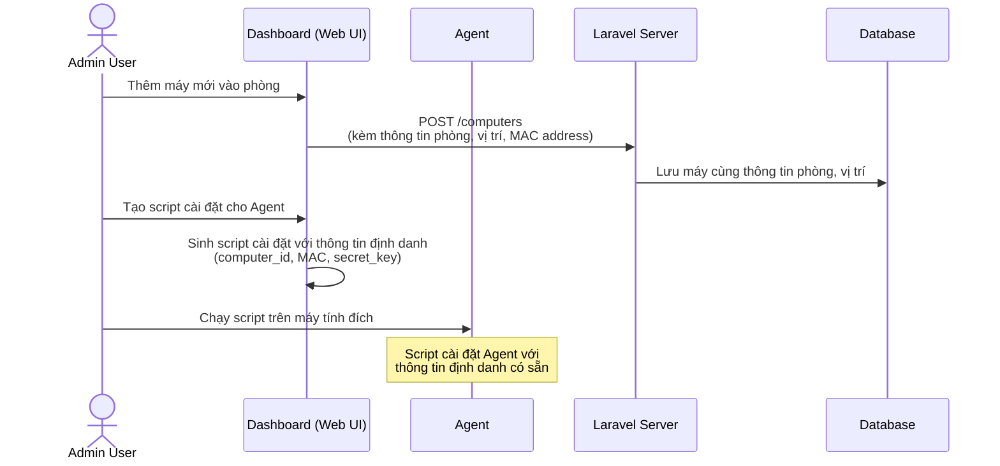
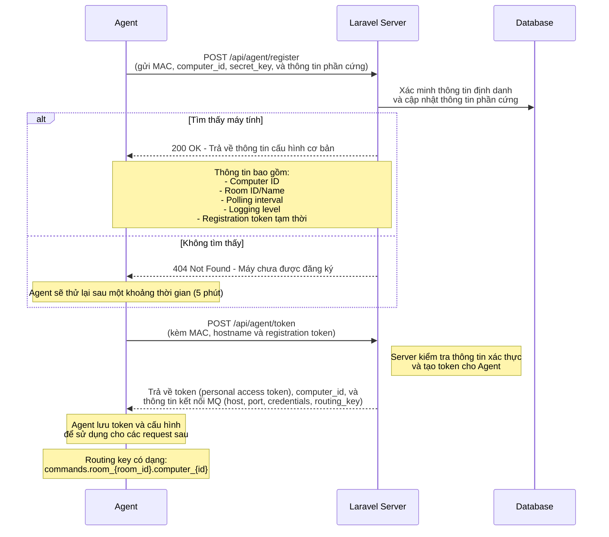
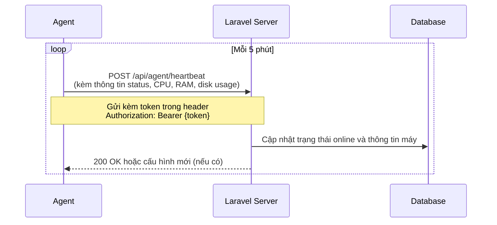
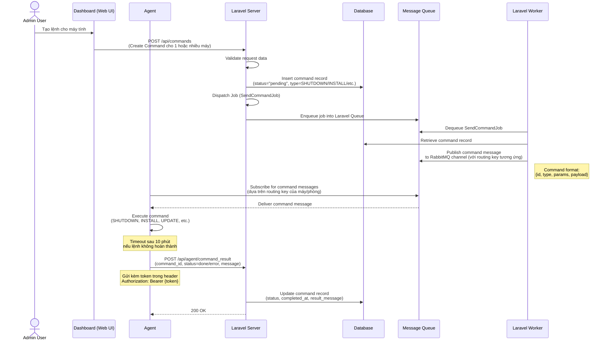
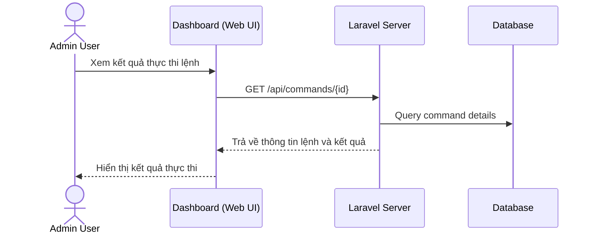

# UniLab - Hệ thống quản lý phòng máy thực hành

## Giới thiệu
UniLab là một hệ thống quản lý phòng máy thực hành cho trường đại học/cao đẳng, cung cấp khả năng giám sát và điều khiển máy tính từ xa thông qua giao diện web.

## Kiến trúc hệ thống

### Thành phần chính
- **Dashboard (Web UI)**: Giao diện người dùng cho admin
- **Laravel Server**: Backend API server
- **Agent**: Phần mềm chạy trên máy tính client
- **Message Queue**: RabbitMQ để truyền lệnh từ server đến agent
- **Database**: Lưu trữ thông tin phòng, máy, lệnh và kết quả

### Luồng hoạt động của hệ thống

Hệ thống UniLab hoạt động thông qua các luồng xử lý chính như sau:

#### 1. Thiết lập ban đầu và cài đặt Agent


#### 2. Đăng ký và xác thực Agent


#### 3. Cơ chế heartbeat và giám sát


#### 4. Xử lý và thực thi lệnh


#### 5. Xem kết quả thực thi


## Chi tiết API Endpoints

### 1. API Đăng ký và Xác thực Agent

#### **POST /api/agent/register**
   - **Mô tả**: Agent đăng ký với hệ thống khi khởi động đầu tiên
   - **Request**:
     ```json
     {
       "mac_address": "00:1B:44:11:3A:B7",
       "hostname": "LAB-PC-42",
       "os": "Windows 10 Pro 22H2",
       "specs": {
         "cpu": "Intel Core i5-10400",
         "ram": "16GB",
         "disk": "500GB SSD",
         "gpu": "Intel UHD Graphics 630"
       }
     }
     ```
   - **Response Success** (200 OK):
     ```json
     {
       "success": true,
       "computer_id": "550e8400-e29b-41d4-a716-446655440000",
       "room": {
         "id": "123",
         "name": "Lab A1-404"
       },
       "config": {
         "polling_interval": 300,
         "logging_level": "info"
       },
       "registration_token": "temp_token_for_next_step"
     }
     ```
   - **Response Failure** (404 Not Found):
     ```json
     {
       "success": false,
       "message": "Computer not found in system",
       "retry_after": 300
     }
     ```

#### **POST /api/agent/token**
   - **Mô tả**: Lấy token xác thực cho Agent sau khi đăng ký thành công
   - **Request**:
     ```json
     {
       "mac_address": "00:1B:44:11:3A:B7",
       "hostname": "LAB-PC-42",
       "registration_token": "temp_token_for_next_step"
     }
     ```
   - **Response** (200 OK):
     ```json
     {
       "token": "eyJ0eXAiOiJKV1QiLCJhbGciOiJIUzI1NiJ9...",
       "computer_id": "550e8400-e29b-41d4-a716-446655440000",
       "mq_config": {
         "host": "rabbitmq.example.com",
         "port": 5672,
         "username": "agent_user",
         "password": "********",
         "virtual_host": "/",
         "exchange": "commands",
         "routing_key": "commands.room_123.computer_550e8400"
       }
     }
     ```

### 2. API Heartbeat và Trạng Thái

#### **POST /api/agent/heartbeat**
   - **Mô tả**: Agent gửi trạng thái định kỳ
   - **Headers**: `Authorization: Bearer {token}`
   - **Request**:
     ```json
     {
       "computer_id": "550e8400-e29b-41d4-a716-446655440000",
       "status": "online",
       "resources": {
         "cpu_usage": 15.5,
         "ram_usage": 4567452672,
         "ram_total": 17179869184,
         "disk_usage": 250500000000,
         "disk_total": 500000000000
       },
       "agent_version": "1.0.5",
       "uptime": 18542
     }
     ```
   - **Response** (200 OK):
     ```json
     {
       "success": true,
       "config_changed": false
     }
     ```

### 3. API Kết quả Lệnh

#### **POST /api/agent/command_result**
   - **Mô tả**: Agent gửi kết quả thực thi lệnh
   - **Headers**: `Authorization: Bearer {token}`
   - **Request**:
     ```json
     {
       "command_id": "a1b2c3d4-e5f6-4a5b-8c7d-9e0f1a2b3c4d",
       "status": "done", // hoặc "error"
       "message": "Command executed successfully"
     }
     ```
   - **Response** (200 OK):
     ```json
     {
       "success": true,
       "message": "Command status updated successfully"
     }
     ```

## Các loại lệnh hỗ trợ

1. **SHUTDOWN**: Tắt máy tính
   - Params: `{ "delay": 60, "force": false }`

2. **RESTART**: Khởi động lại máy tính
   - Params: `{ "delay": 30, "force": false }`

3. **INSTALL**: Cài đặt phần mềm
   - Params: `{ "package": "vscode", "version": "latest" }`

4. **UPDATE**: Cập nhật hệ thống/phần mềm
   - Params: `{ "target": "system" }` hoặc `{ "target": "application", "name": "chrome" }`

5. **EXECUTE**: Thực thi lệnh/script
   - Params: `{ "command": "ipconfig /flushdns", "shell": "cmd" }`

## Xử lý lỗi và phục hồi

1. **Mất kết nối**:
   - Agent sẽ lưu cache lệnh chưa hoàn thành
   - Tự động kết nối lại sau 30 giây và tiếp tục thực thi

2. **Lệnh thất bại**:
   - Thử lại tối đa 3 lần với các lệnh quan trọng
   - Ghi log chi tiết lỗi và gửi về server

3. **Token hết hạn**:
   - Tự động làm mới token khi gặp lỗi 401 Unauthorized
   - Quay lại quy trình đăng ký nếu không thể làm mới token

### Roadmap:
- [x] ~~TODO: Xây dựng API nhận kết quả từ Agent~~ (Đã hoàn thành)
- [ ] TODO: Xây dựng API đăng ký Agent và xác thực
- [ ] TODO: Xây dựng cơ chế heartbeat để theo dõi trạng thái máy
- [ ] TODO: Hoàn thiện hệ thống phân phối lệnh qua Message Queue
