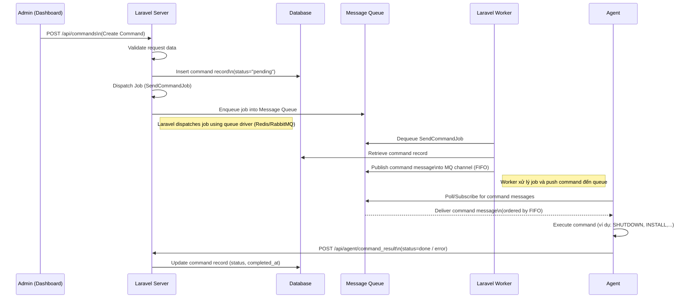

### Luồng hoạt động từ lúc Admin (Dashboard) tạo lệnh cho đến khi Agent nhận và thực thi lệnh

```mermaid
sequenceDiagram
    participant Admin as Admin (Dashboard)
    participant S as Laravel Server
    participant DB as Database
    participant MQ as Message Queue
    participant W as Laravel Worker
    participant A as Agent

    Admin->>S: POST /api/commands\n(Create Command)
    S->>S: Validate request data
    S->>DB: Insert command record\n(status="pending")
    S->>S: Dispatch Job (SendCommandJob)
    S->>MQ: Enqueue job into Message Queue
    Note right of S: Laravel dispatches job using queue driver (Redis/RabbitMQ)
    W->>MQ: Dequeue SendCommandJob
    W->>DB: Retrieve command record
    W->>MQ: Publish command message\nto MQ channel (FIFO)
    Note right of W: Worker xử lý job và push command đến queue
    A->>MQ: Poll/Subscribe for command messages
    MQ-->>A: Deliver command message\n(ordered by FIFO)
    A->>A: Execute command (ví dụ: SHUTDOWN, INSTALL,...)
    A->>S: POST /api/agent/command_result\n(status=done / error)
    S->>DB: Update command record (status, completed_at)
```
