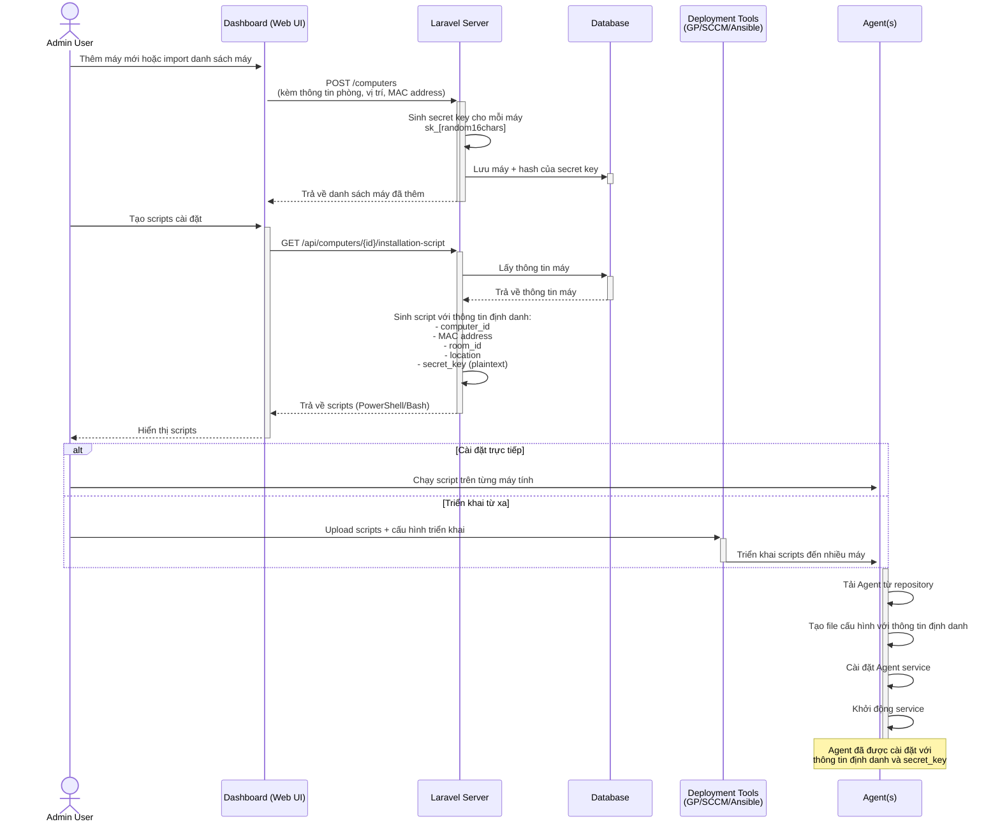
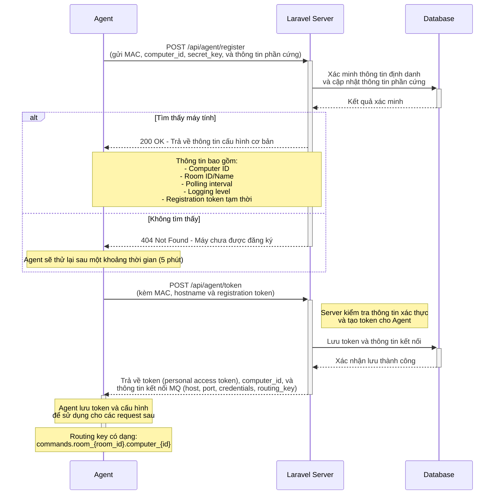
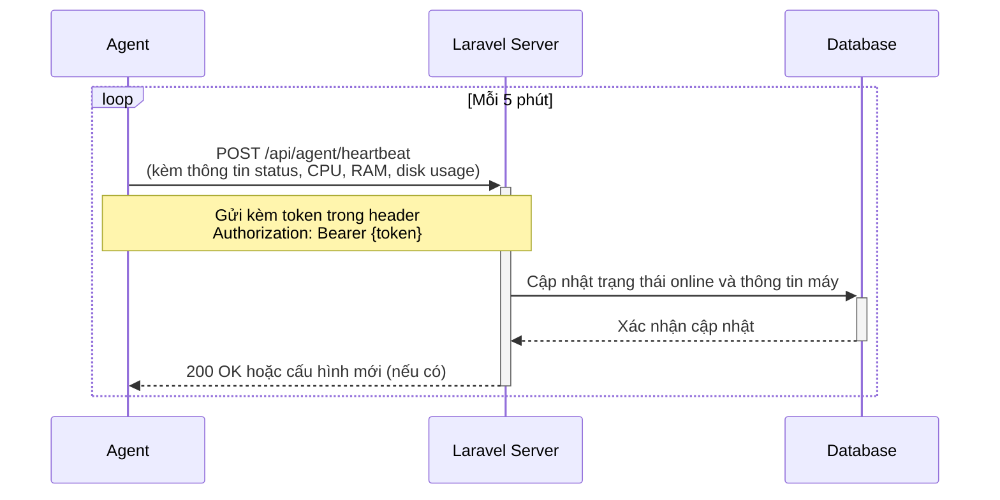
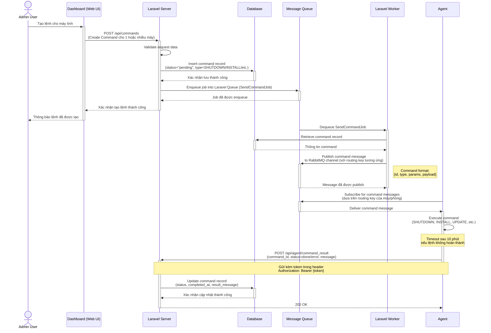
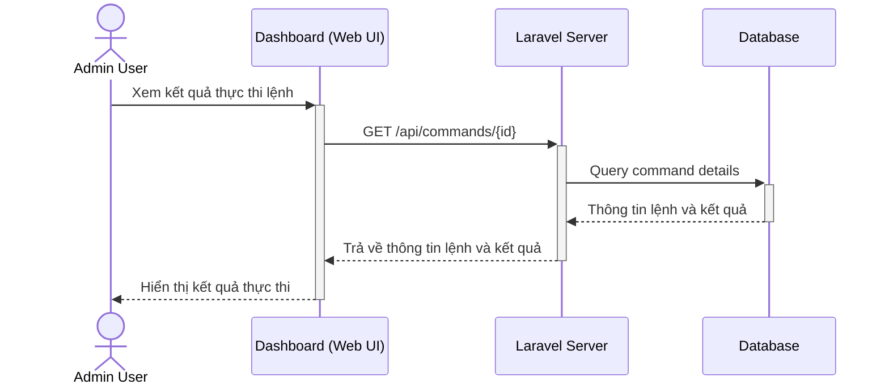

# UniLab - Hệ thống quản lý phòng máy thực hành

## Giới thiệu
UniLab là một hệ thống quản lý phòng máy thực hành cho trường đại học/cao đẳng, cung cấp khả năng giám sát và điều khiển máy tính từ xa thông qua giao diện web.

## Kiến trúc hệ thống

### Thành phần chính
- **Dashboard (Web UI)**: Giao diện người dùng cho admin
- **Laravel Server**: Backend API server
- **Agent**: Phần mềm chạy trên máy tính client
- **Message Queue**: RabbitMQ để truyền lệnh từ server đến agent
- **Database**: Lưu trữ thông tin phòng, máy, lệnh và kết quả

### Quy trình tạo và sử dụng Agent Installation Scripts

#### Tổng quan về Installation Scripts
Thay vì sử dụng installer truyền thống, hệ thống tạo script cài đặt tự động cho từng máy tính. Script này sẽ thực hiện việc tải, cài đặt và cấu hình Agent để kết nối với server.

#### Quy trình tạo Installation Scripts
1. **Tạo Script Cá nhân hóa**:
   - Admin chọn máy tính cần cài đặt Agent trong Dashboard
   - Hệ thống sinh script cài đặt (PowerShell/Bash) riêng cho máy tính đó
   - Script được tạo với các thông số nhận dạng máy tính đã được định nghĩa trước

2. **Nội dung Script**:
   - Tải xuống phần mềm Agent từ repository
   - Tạo file cấu hình với thông tin đặc thù cho máy tính
   - Cài đặt Agent và đăng ký nó như service hệ thống
   - Khởi động service và xác minh kết nối với server

#### Ví dụ về Installation Script

**PowerShell Script (Windows):**
```powershell
# UniLab Agent Installation Script
# Auto-generated for Computer: LAB-PC-42 in Room: A1-404
# Generated on: 2025-03-08

$SERVER_URL = "https://unilab.example.com"
$SECRET_KEY = "sk_wAb5DcE2fG3hI4jK5"
$AGENT_DOWNLOAD_URL = "https://unilab.example.com/downloads/agent/latest/windows"
$CONFIG_DIR = "C:\ProgramData\UniLab\Agent"
$INSTALL_DIR = "C:\Program Files\UniLab\Agent"

Write-Host "Starting UniLab Agent installation..." -ForegroundColor Green

# Create directories
if (-not (Test-Path $CONFIG_DIR)) { New-Item -Path $CONFIG_DIR -ItemType Directory -Force }
if (-not (Test-Path $INSTALL_DIR)) { New-Item -Path $INSTALL_DIR -ItemType Directory -Force }

# Download Agent
Write-Host "Downloading Agent software..." -ForegroundColor Yellow
Invoke-WebRequest -Uri $AGENT_DOWNLOAD_URL -OutFile "$INSTALL_DIR\agent.zip"
Expand-Archive -Path "$INSTALL_DIR\agent.zip" -DestinationPath $INSTALL_DIR -Force
Remove-Item -Path "$INSTALL_DIR\agent.zip"

# Create configuration file
$ConfigJson = @{
    server = @{
        url = $SERVER_URL
        api_base = "/api/agent"
    }
    agent = @{
        heartbeat_interval = 300
        logging_level = "info"
    }
    security = @{
        secret_key = $SECRET_KEY
    }
} | ConvertTo-Json

$ConfigJson | Out-File -FilePath "$CONFIG_DIR\config.json" -Encoding UTF8

# Install as service
Write-Host "Installing as Windows Service..." -ForegroundColor Yellow
& "$INSTALL_DIR\install-service.exe"

# Start service
Write-Host "Starting UniLab Agent service..." -ForegroundColor Yellow
Start-Service -Name "UniLabAgent"

# Verify
$Status = Get-Service -Name "UniLabAgent" | Select-Object -ExpandProperty Status
if ($Status -eq "Running") {
    Write-Host "Installation completed successfully!" -ForegroundColor Green
} else {
    Write-Host "Installation completed, but service is not running. Please check logs." -ForegroundColor Red
}
```

#### Ưu điểm của phương pháp Script tự động
1. **Tính linh hoạt**: Dễ dàng điều chỉnh cho từng hệ điều hành và môi trường
2. **Minh bạch**: Admin có thể xem và hiểu chính xác những gì script thực hiện
3. **Khắc phục sự cố**: Dễ dàng thêm các bước chẩn đoán và xử lý lỗi
4. **Tự động hóa**: Hỗ trợ triển khai hàng loạt thông qua Group Policy/Ansible

#### Quy trình sử dụng
1. **Tải script**: Admin tải script từ Dashboard
2. **Chạy script**: Admin chạy script trên máy tính đích với quyền admin
3. **Xác minh**: Script tự động cài đặt, cấu hình và khởi động Agent
4. **Đăng ký**: Agent khi khởi động sẽ tự động đăng ký với server

#### Triển khai hàng loạt
Hệ thống hỗ trợ cài đặt Agent trên nhiều máy tính cùng lúc mà không cần admin phải đi từng máy:

1. **Sử dụng Group Policy (cho Windows domain)**:
   - Admin tạo scripts cho nhiều máy từ Dashboard
   - Đóng gói scripts vào package MSI hoặc Group Policy Object (GPO)
   - Triển khai qua Group Policy trong Active Directory
   - Scripts tự động chạy khi máy khởi động/đăng nhập

2. **Sử dụng công cụ phân phối từ xa**:
   ```powershell
   # Ví dụ script PowerShell để triển khai từ xa
   $computers = Get-Content "lab-computers.txt"
   $scriptFolder = "C:\Scripts\InstallationScripts\"

   foreach ($computer in $computers) {
       # Kiểm tra kết nối
       if (Test-Connection $computer -Count 1 -Quiet) {
           # Sao chép script cài đặt
           Copy-Item "$scriptFolder\$computer-install.ps1" "\\$computer\c$\Temp\"
           
           # Chạy script từ xa với đặc quyền admin
           Invoke-Command -ComputerName $computer -ScriptBlock {
               Start-Process powershell -ArgumentList "-ExecutionPolicy Bypass -File C:\Temp\$using:computer-install.ps1" -Verb RunAs
           }
       }
   }
   ```

3. **Sử dụng công cụ quản lý cấu hình**:
   - SCCM (Microsoft System Center Configuration Manager)
   - Ansible (cho Linux/macOS)
   - Puppet hoặc Chef

#### Cấu trúc thông tin định danh
Mỗi script cài đặt chứa thông tin định danh riêng cho từng máy tính:

```json
// Cấu trúc identification trong config.json
{
  "identification": {
    "computer_id": "550e8400-e29b-41d4-a716-446655440000",
    "mac_address": "00:1B:44:11:3A:B7", 
    "room_id": "123",
    "location": "R3-S5",
    "expected_hostname": "LAB-PC-42"
  },
  "security": {
    "secret_key": "sk_wAb5DcE2fG3hI4jK5"
  }
}
```

#### Về Secret Key
Secret key đóng vai trò quan trọng trong quy trình xác thực Agent:

1. **Mục đích**:
   - Cơ chế xác thực một lần trong quá trình đăng ký ban đầu
   - Ngăn chặn việc máy tính không xác định tự đăng ký vào hệ thống
   - Đóng vai trò "mật khẩu tạm thời" trước khi token hệ thống được cấp

2. **Lưu trữ**:
   - **Database**: Lưu dạng hash cùng với bản ghi máy tính
   - **Script**: Nhúng dạng plaintext để sử dụng khi cài đặt
   - **Agent**: Lưu tạm thời trong quá trình đăng ký, xóa sau khi nhận token

3. **Sinh và xác thực**:
   ```php
   // Sinh secret key (Laravel)
   $secretKey = 'sk_' . Str::random(16);
   $computer->secret_key = Hash::make($secretKey);
   
   // Xác thực secret key (Laravel)
   if (!Hash::check($request->secret_key, $computer->secret_key)) {
       return response()->json(['error' => 'Invalid secret key'], 401);
   }
   ```

4. **Vòng đời**:
   - Được tạo khi admin thêm máy tính vào hệ thống
   - Sử dụng trong quá trình đăng ký Agent
   - Bị vô hiệu hóa sau lần sử dụng đầu tiên thành công
   - Có thể tạo lại nếu cần thiết (ví dụ: cài đặt lại Agent)

### Luồng hoạt động của hệ thống

Hệ thống UniLab hoạt động thông qua các luồng xử lý chính như sau:

#### 1. Thiết lập ban đầu và cài đặt Agent


#### 2. Đăng ký và xác thực Agent


#### 3. Cơ chế heartbeat và giám sát


#### 4. Xử lý và thực thi lệnh


#### 5. Xem kết quả thực thi


## Chi tiết API Endpoints

### 1. API Đăng ký và Xác thực Agent

#### **POST /api/agent/register**
   - **Mô tả**: Agent đăng ký với hệ thống khi khởi động đầu tiên
   - **Request**:
     ```json
     {
       "computer_id": "550e8400-e29b-41d4-a716-446655440000", 
       "mac_address": "00:1B:44:11:3A:B7",
       "secret_key": "sk_wAb5DcE2fG3hI4jK5",
       "hostname": "LAB-PC-42",
       "os": {
         "name": "Windows",
         "version": "10 Pro", 
         "build": "22H2"
       },
       "specs": {
         "cpu": "Intel Core i5-10400",
         "cpu_cores": 6,
         "cpu_threads": 12,
         "ram_total": 17179869184,
         "disk_total": 500107862016,
         "disk_free": 213546065920,
         "gpu": "Intel UHD Graphics 630"
       },
       "agent_version": "1.0.5",
       "installation_timestamp": 1709125482
     }
     ```
   - **Quy trình xác minh**:
     ```php
     // Quy trình xác minh (Laravel)
     $computer = Computer::find($request->computer_id);

     if (!$computer || 
         $computer->mac_address !== $request->mac_address ||
         !Hash::check($request->secret_key, $computer->secret_key)) {
         return response()->json(['error' => 'Invalid identification'], 401);
     }

     // Đánh dấu secret_key đã được sử dụng 
     $computer->secret_key_used = true;
     $computer->save();
     ```
   - **Response Success** (200 OK):
     ```json
     {
       "success": true,
       "room": {
         "id": "123",
         "name": "Lab A1-404"
       },
       "config": {
         "polling_interval": 300,
         "logging_level": "info",
         "client_update": {
           "available": false,
           "version": null
         }
       },
       "registration_token": "temp_token_for_next_step",
       "token_expires_at": "2025-03-09T12:30:00Z"
     }
     ```
   - **Response Failure** (404 Not Found):
     ```json
     {
       "success": false,
       "message": "Computer not found in system",
       "retry_after": 300
     }
     ```

#### **POST /api/agent/token**
   - **Mô tả**: Lấy token xác thực cho Agent sau khi đăng ký thành công
   - **Request**:
     ```json
     {
       "registration_token": "temp_token_for_next_step",
       "computer_id": "550e8400-e29b-41d4-a716-446655440000",
       "mac_address": "00:1B:44:11:3A:B7",
       "hostname": "LAB-PC-42"
     }
     ```
   - **Response** (200 OK):
     ```json
     {
       "token": "eyJ0eXAiOiJKV1QiLCJhbGciOiJIUzI1NiJ9...",
       "token_expires_at": "2025-04-09T00:00:00Z",
       "mq_config": {
         "host": "rabbitmq.example.com",
         "port": 5672,
         "username": "agent_user",
         "password": "********",
         "virtual_host": "/",
         "exchange": "commands",
         "routing_key": "commands.room_123.computer_550e8400"
       },
       "api_endpoints": {
         "heartbeat": "/api/agent/heartbeat",
         "command_result": "/api/agent/command_result",
         "token_refresh": "/api/agent/refresh_token"
       }
     }
     ```

#### **Ý nghĩa của các tham số cấu hình**

##### **Config từ server**
Các tham số cấu hình này đóng vai trò quan trọng trong việc kiểm soát hành vi của Agent:

1. **`polling_interval: 300`**
   - **Đơn vị**: Giây
   - **Tác dụng**: Xác định tần suất Agent gửi heartbeat đến server
   - **Ý nghĩa thực tế**: Mỗi 5 phút (300 giây), Agent sẽ gửi thông tin trạng thái lên server
   - **Lợi ích**:
     - Server biết máy tính có đang hoạt động hay không
     - Giảm tải cho server và mạng (so với heartbeat quá thường xuyên)
     - Có thể điều chỉnh tùy theo nhu cầu giám sát (giảm xuống khi cần giám sát chặt chẽ)

2. **`logging_level: "info"`**
   - **Tác dụng**: Điều khiển mức độ chi tiết của thông tin log từ Agent
   - **Các mức có thể có**:
     - `debug`: Mọi thông tin, chi tiết nhất (hữu ích khi gỡ lỗi)
     - `info`: Thông tin hoạt động thông thường
     - `warning`: Chỉ ghi cảnh báo và lỗi 
     - `error`: Chỉ ghi lỗi nghiêm trọng
   - **Lợi ích**: Giúp quản lý kích thước file log và tìm kiếm thông tin quan trọng

3. **`client_update`**
   - **Tác dụng**: Cơ chế tự động cập nhật Agent
   - **Các tham số con**:
     - `available: false`: Hiện không có bản cập nhật mới
     - `version: null`: Không có phiên bản mới nào được xác định
   - **Khi có cập nhật**:
     ```json
     "client_update": {
       "available": true,
       "version": "1.0.6",
       "download_url": "https://unilab.example.com/downloads/agent/1.0.6/windows",
       "force_update": false,
       "changelog": "Cải thiện bảo mật, sửa lỗi kết nối"
     }
     ```
   - **Lợi ích**: 
     - Quản lý phiên bản phần mềm tập trung
     - Tự động cập nhật không cần thủ công
     - Đảm bảo tất cả Agent đều chạy phiên bản mới nhất

Server có thể thay đổi các tham số này qua các lần heartbeat để điều chỉnh hành vi Agent từ xa.

### 2. API Heartbeat và Trạng Thái

#### **POST /api/agent/heartbeat**
   - **Mô tả**: Agent gửi trạng thái định kỳ
   - **Headers**: `Authorization: Bearer {token}`
   - **Request**:
     ```json
     {
       "computer_id": "550e8400-e29b-41d4-a716-446655440000",
       "status": "online",
       "resources": {
         "cpu_usage": 15.5,
         "ram_usage": 4567452672,
         "ram_total": 17179869184,
         "disk_usage": 250500000000,
         "disk_total": 500000000000
       },
       "agent_version": "1.0.5",
       "uptime": 18542
     }
     ```
   - **Response** (200 OK):
     ```json
     {
       "success": true,
       "config_changed": false
     }
     ```

### 3. API Kết quả Lệnh

#### **POST /api/agent/command_result**
   - **Mô tả**: Agent gửi kết quả thực thi lệnh
   - **Headers**: `Authorization: Bearer {token}`
   - **Request**:
     ```json
     {
       "command_id": "a1b2c3d4-e5f6-4a5b-8c7d-9e0f1a2b3c4d",
       "status": "done", // hoặc "error"
       "message": "Command executed successfully"
     }
     ```
   - **Response** (200 OK):
     ```json
     {
       "success": true,
       "message": "Command status updated successfully"
     }
     ```

## Các loại lệnh hỗ trợ

1. **SHUTDOWN**: Tắt máy tính
   - Params: `{ "delay": 60, "force": false }`

2. **RESTART**: Khởi động lại máy tính
   - Params: `{ "delay": 30, "force": false }`

3. **INSTALL**: Cài đặt phần mềm
   - Params: `{ "package": "vscode", "version": "latest" }`

4. **UPDATE**: Cập nhật hệ thống/phần mềm
   - Params: `{ "target": "system" }` hoặc `{ "target": "application", "name": "chrome" }`

5. **EXECUTE**: Thực thi lệnh/script
   - Params: `{ "command": "ipconfig /flushdns", "shell": "cmd" }`

## Xử lý lỗi và phục hồi

1. **Mất kết nối**:
   - Agent sẽ lưu cache lệnh chưa hoàn thành
   - Tự động kết nối lại sau 30 giây và tiếp tục thực thi

2. **Lệnh thất bại**:
   - Thử lại tối đa 3 lần với các lệnh quan trọng
   - Ghi log chi tiết lỗi và gửi về server

3. **Token hết hạn**:
   - Tự động làm mới token khi gặp lỗi 401 Unauthorized
   - Quay lại quy trình đăng ký nếu không thể làm mới token

## Roadmap:
- [x] ~~TODO: Xây dựng API nhận kết quả từ Agent~~ (Đã hoàn thành)
- [ ] TODO: Xây dựng API đăng ký Agent và xác thực
- [ ] TODO: Xây dựng cơ chế heartbeat để theo dõi trạng thái máy
- [ ] TODO: Hoàn thiện hệ thống phân phối lệnh qua Message Queue
