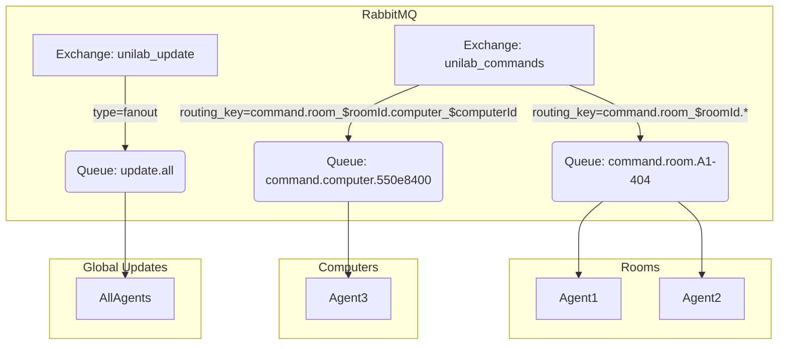

# Kiến trúc hệ thống UniLab

## 1. Tổng quan kiến trúc

- **Dashboard (Web UI)**: Giao diện người dùng cho admin, được xây dựng bằng Inertia.js với Vue.js
- **Laravel Server**: Backend API server, sử dụng Laravel framework
- **Agent**: Phần mềm chạy trên máy tính client, được phát triển bằng Python
- **Message Queue**: RabbitMQ để truyền lệnh từ server đến agent
- **Database**: Supabase - nền tảng database PostgreSQL, sử dụng để lưu trữ thông tin phòng, máy, lệnh và kết quả

## 2. Thiết kế Message Queue

Hệ thống UniLab sử dụng RabbitMQ làm Message Queue để giao tiếp giữa Laravel Server và Agent, đảm bảo việc truyền lệnh và cập nhật đáng tin cậy, có khả năng mở rộng.

### 2.1 Kiến trúc RabbitMQ



### 2.2 Cấu trúc Exchange và Routing

| Thành phần       | Loại Exchange | Routing Key Pattern         | Mục đích                         |
| ---------------- | ------------- | --------------------------- | -------------------------------- |
| command_exchange | Topic         | command.<scope>.<target>    | Điều khiển máy tính/phòng cụ thể |
| update_exchange  | Fanout        | N/A                         | Cập nhật toàn hệ thống           |
| events_exchange  | Topic         | events.<type>.<computer_id> | Nhận sự kiện từ các agent        |

### 2.3 Routing Key Design

| Pattern                      | Ví dụ                     | Mô tả                     |
| ---------------------------- | ------------------------- | ------------------------- |
| command.room.\<room_id\>     | command.room.A1-404       | Lệnh cho toàn bộ phòng    |
| command.computer.\<comp_id\> | command.computer.550e8400 | Lệnh cho máy tính cụ thể  |
| command.all                  | command.all               | Lệnh cho toàn bộ hệ thống |

### 2.4 Cấu trúc message cập nhật

```json
{
    "type": "SYSTEM_UPDATE",
    "payload": {
        "version": "1.1.0",
        "release_date": "2025-03-15",
        "mandatory": true,
        "checksum": "sha256:9f86d081...",
        "download_url": "https://unilab.example.com/updates/v1.1.0",
        "changelog": ["Cải thiện hiệu suất", "Sửa lỗi bảo mật quan trọng"]
    },
    "conditions": {
        "min_agent_version": "1.0.2",
        "os_requirements": ["windows >= 10", "linux >= ubuntu20.04"]
    }
}
```

## 3. Mô hình dữ liệu

### 3.1 Các entity chính

### 3.2 Quan hệ
