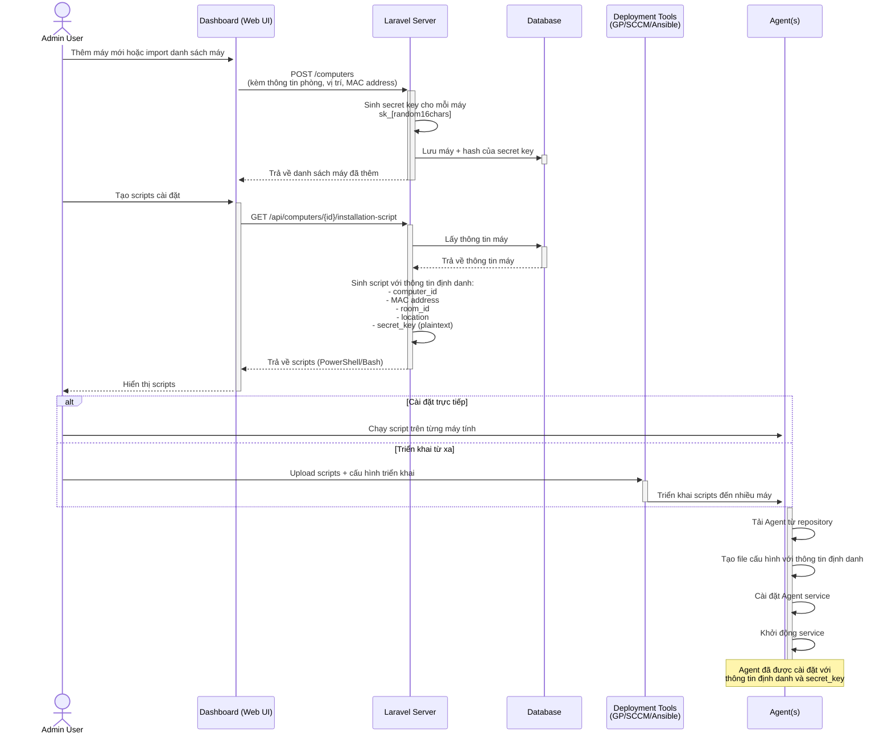
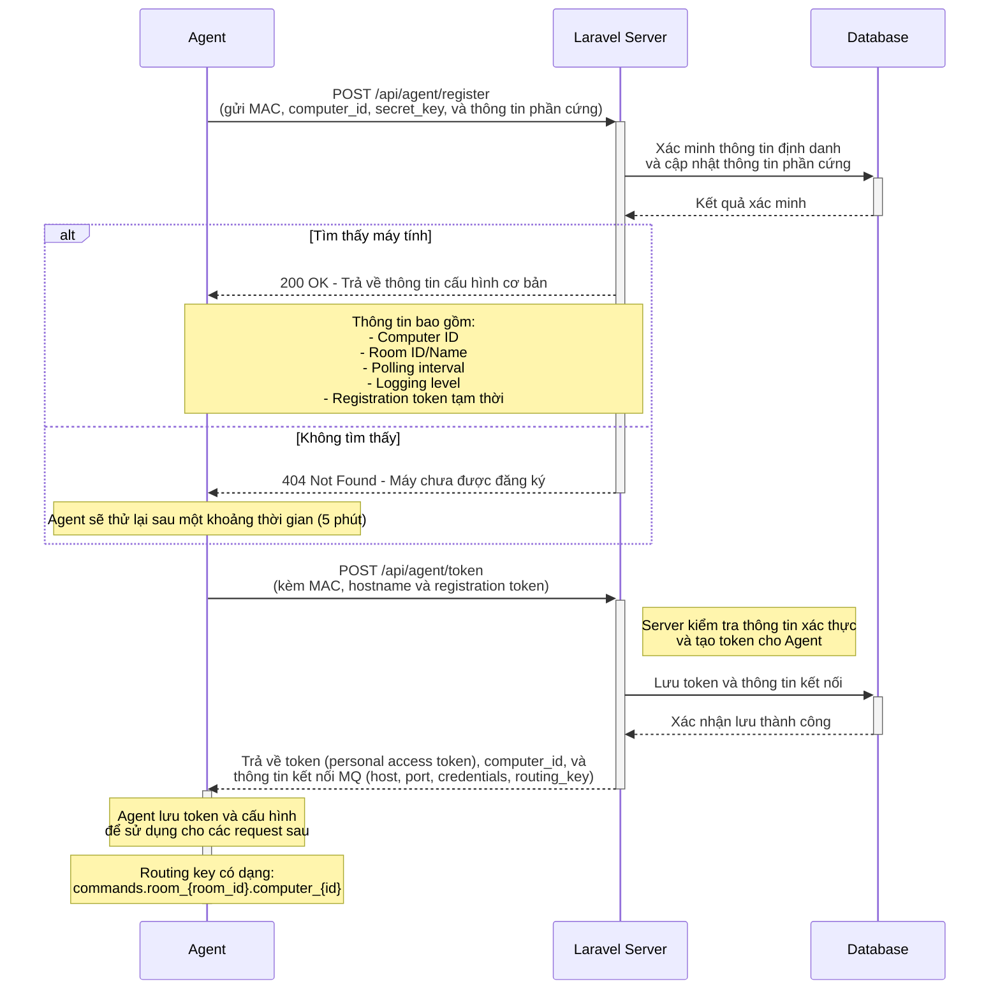
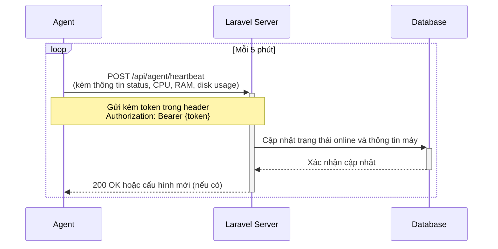
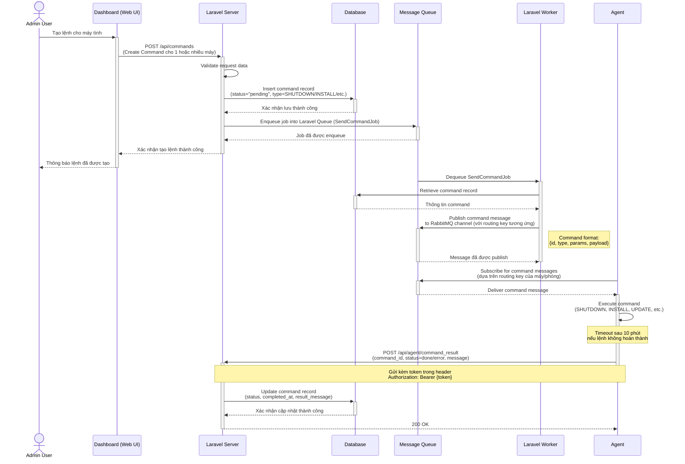
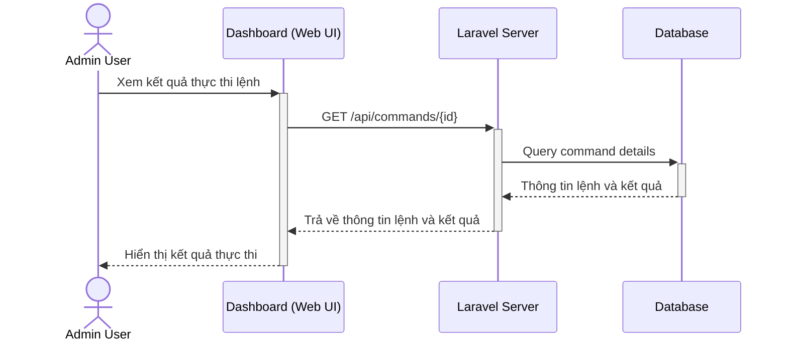
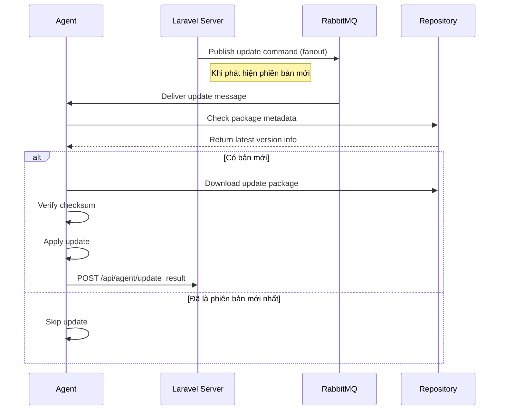

# Quy trình hoạt động của UniLab

Hệ thống UniLab hoạt động thông qua các luồng xử lý chính như sau:

## 1. Thiết lập ban đầu và cài đặt Agent

## 2. Đăng ký và xác thực Agent

## 3. Cơ chế heartbeat và giám sát

## 4. Xử lý và thực thi lệnh

## 5. Xem kết quả thực thi

## 6. Cơ chế Cập nhật Tự động

Luồng cập nhật phiên bản:

